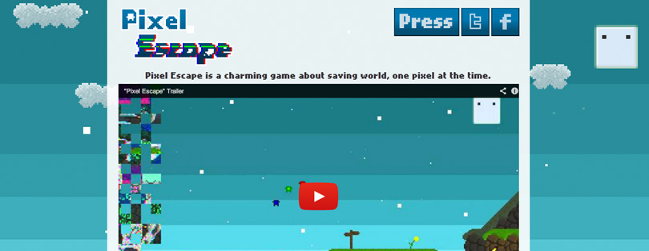

**Update 10/02/2017**:

Unfortunatly the site is no more and the game will no longer be updated. Dont expect the links below to work.

---

The game is about saving Pixel-land, the world where innocent little pixels live. You do this by using the space key to jump and the mouse can draw lines for the pixels to walk on.

You can [view a trailer](https://www.youtube.com/watch?v=3wNNU1XjeQc) for the game or [play it](http://www.crazygames.com/game/pixel-escape).

The site has been styled using assets from the game. Using CSS animations, I made the clouds move across the background.
