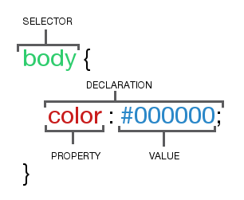

I was describing the mark-up of a CSS rule to someone learning CSS. I though it would be handy to have a reference for it, so I created the following reference image for him.

Lets break it down into parts:
* The whole thing is a ruleset
* The curly braces and everything inside is a declaration block
* The bit before the opening curly brace is a selector
* A declaration has two parts, separated by a colon and ending in a semicolon
* Each declaration has a property (before the semi colon) and a value (after the semi colon) 

A selector can be any, or a combination of:
* A class (.selector)
* An ID (#selector)
* An element (body)
* A Pseudo-Class (:hover)
* A Pseudo-Element (::after)

You can find out more from the following links:
* [MDN's CSS Syntax](https://developer.mozilla.org/en-US/docs/Web/CSS/Syntax)
* [CSS Ruleset terminology on CSS Tricks](https://css-tricks.com/css-ruleset-terminology/)
* [CSS definitions by Louis Lazaris](https://www.impressivewebs.com/css-terms-definitions/)
